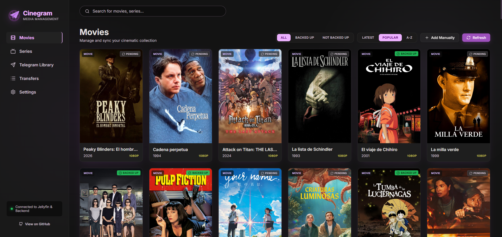

# Cinegram

Cinegram is a self-hosted platform that bridges a [Jellyfin](https://jellyfin.org/) media library with [Telegram](https://telegram.org/). It automates downloading movies and series from Telegram, processes and renames them to Jellyfin's naming convention, and can also back up existing Jellyfin files to Telegram.



It ships as three services orchestrated with Docker Compose, so a full deployment is a single `docker compose up`.

## Key Features

- **Bidirectional Media Transfer**: Download files from Telegram directly into your Jellyfin library, or back up existing Jellyfin media to Telegram.
- **Automatic Large File Handling**: Circumvents Telegram's 2 GB bot upload limit by splitting larger files into 1.95 GB multi-part archives using store-only `7z` compression, rejoining them automatically on download.
- **Metadata & Naming Standardization**: Integrates with TMDB to fetch metadata, posters, and standardize filenames/folder structures for Jellyfin.
- **Multi-User Access Control**: Restricts bot commands and storage privileges to authorized Telegram user IDs.
- **Web UI & Bot Interface**: Manage imports, search your library, and monitor transfer queues via the Vue web dashboard or Telegram chat.

## Architecture

Cinegram is a decoupled set of three services:

| Service    | Stack                              | Role                                                                                     |
| ---------- | ---------------------------------- | ---------------------------------------------------------------------------------------- |
| `web`      | Vue 3 + Vite + TypeScript          | Admin panel: browse the library, manage download/upload queues, re-identify collections. |
| `backend`  | Python 3.12 + FastAPI + SQLModel   | Source of truth: REST API, filename parsing, TMDB metadata, task queues (SQLite).        |
| `bot-net`  | C# / .NET 8 + WTelegramClient      | Worker: polls tasks, transfers files over Telegram (MTProto), splits/joins with `7z`, reads metadata with `ffprobe`. |

```
User ─▶ web (Vue) ─▶ backend (FastAPI) ─▶ SQLite / TMDB
                          ▲
                          │ polls tasks & reports status
                       bot-net (.NET) ─▶ Telegram (MTProto)
                                       ─▶ Host disk (Jellyfin media)
```

The `bot-net` worker authenticates as a Telegram **bot**, which caps file transfers at 2 GB; files larger than that are split into **1.95 GB** parts with `7z` (store-only) on upload and rejoined on download.

## Prerequisites

- Docker and Docker Compose.
- A running Jellyfin server and an API token.
- Telegram API credentials (`api_id` / `api_hash` from <https://my.telegram.org>) and a bot token from [@BotFather](https://t.me/BotFather).
- A [TMDB](https://www.themoviedb.org/settings/api) API key.

## Quick start

1. Clone the repository.
2. Copy the environment template and fill in your own values:
   ```bash
   cp .env.example .env
   # edit .env
   ```
3. Point `IMPORT_MOVIES_DIR` and `IMPORT_SHOWS_DIR` at the host directories where Jellyfin expects movies and shows (these are bind-mounted into `bot-net`).
4. Start the stack:
   ```bash
   docker compose up -d --build
   ```
5. Open the web panel at `http://<host>:5173`.

## Environment variables

All configuration lives in `.env` (see `.env.example` for the template).

| Variable                | Description                                                                                     |
| ----------------------- | ----------------------------------------------------------------------------------------------- |
| `JELLYFIN_URL`          | Base URL of your Jellyfin server (e.g. `http://your-jellyfin-host:8096`). Consumed by the web build as `VITE_JELLYFIN_URL`; if left empty the web falls back to the browser host on port 8096. |
| `JELLYFIN_TOKEN`        | Jellyfin API token used by the web client.                                                      |
| `TELEGRAM_API_ID`       | Telegram `api_id` from <https://my.telegram.org>.                                               |
| `TELEGRAM_API_HASH`     | Telegram `api_hash` from <https://my.telegram.org>.                                             |
| `TELEGRAM_BOT_TOKEN`    | Bot token from [@BotFather](https://t.me/BotFather).                                             |
| `TELEGRAM_AUTH_USER_ID` | Telegram user ID allowed to command the bot. Accepts a comma-separated list to authorize several users (e.g. `123,456`); the first ID is the owner whose chat stores the media. |
| `TMDB_API_KEY`          | TMDB API key used for metadata lookups.                                                          |
| `TMDB_CONTENT_LANGUAGE` | Language for titles and overviews (e.g. `en-US`, `es-ES`, `fr-FR`).                              |
| `IMPORT_MOVIES_DIR`     | Host path for the movies library, bind-mounted into `bot-net` at `/data/import/movies`.         |
| `IMPORT_SHOWS_DIR`      | Host path for the shows library, bind-mounted into `bot-net` at `/data/import/shows`.            |
| `PUID` / `PGID`         | User/group IDs the `backend` and `bot-net` containers run as, so they can write to the host media directories (defaults `1000:1000`). |
| `WEB_PORT`              | Host port for the web panel (defaults `5173`). Change it if the port is already in use.          |
| `BACKEND_PORT`          | Host port for the backend API (defaults `8005`). The web reads it as `VITE_BACKEND_PORT`.        |
| `BOT_NET_PORT`          | Host port for the `bot-net` worker (defaults `8088`). The web reads it as `VITE_BOT_NET_PORT`.   |

## Service ports

| Service   | Host port               | Container port |
| --------- | ----------------------- | -------------- |
| `web`     | `${WEB_PORT:-5173}`     | `80`           |
| `backend` | `${BACKEND_PORT:-8005}` | `8000`         |
| `bot-net` | `${BOT_NET_PORT:-8088}` | `8080`         |

All three host ports are configurable in `.env`, so you can move any of them if it clashes with something else already running on the host. The web reads `JELLYFIN_URL` / `JELLYFIN_TOKEN` / `BACKEND_PORT` / `BOT_NET_PORT` as Vite build args, so the browser talks to the services on whatever ports you choose. Because Vite inlines these at build time, re-run `docker compose up -d --build web` after changing them.

The `web` service is built into a static bundle and served by nginx. A `web/Dockerfile.dev` (Vite dev server with hot reload) is kept for local development.

## Security

Cinegram has **no built-in authentication** on the web panel or the backend API: anyone who can reach those ports can browse and modify the library. Only the Telegram bot is access-controlled (via `TELEGRAM_AUTH_USER_ID`). Do **not** expose the `web` or `backend` ports directly to the internet. Keep them on your LAN and reach them through a VPN, or put them behind a reverse proxy that adds authentication and TLS.

## Bot commands

Once the containers are up, control the worker from Telegram (as the user in `TELEGRAM_AUTH_USER_ID`):

| Command                    | Description                                                 |
| -------------------------- | ----------------------------------------------------------- |
| `/start`, `/help`          | Welcome message and list of available commands.             |
| `/health`                  | Report the bot's health.                                    |
| `/add [search query]`      | Search TMDB and add a movie or series to the database.      |
| `/import`                  | Import local Jellyfin media into Telegram and the database. |
| `/search <query>`          | Search the local library (accent-insensitive).              |
| `/movies`, `/series`       | List all registered movies / series.                        |
| `/movie <id\|tmdbid-id>`   | Show a movie's details.                                      |
| `/serie <series-id>`       | Show a series' details.                                      |
| `/orphans`                 | List collections still missing TMDB identification.         |
| `/queue`                   | Show active upload and download transfers.                  |

## Data & Persistence

All persistent application state is stored on the host under `./appdata`:
- `./appdata/backend`: SQLite database storing library metadata, task queues, and media indexes.
- `./appdata/bot-net`: Telegram session state and worker runtime cache.

Make sure to back up the `./appdata` directory when migrating servers or updating containers.

## System dependencies

`bot-net` shells out to `7z` (from `p7zip-full`) for multipart split/join and to `ffprobe` (from `ffmpeg`) for technical metadata. Both are installed inside the `bot-net` Docker image, so no extra host setup is required when running with Docker Compose. If you run the worker outside Docker, make sure `7z` and `ffprobe` are on your `PATH`.

## Troubleshooting

- **Permission errors writing to media folders**: Ensure `PUID` and `PGID` in `.env` match the Linux user/group that owns `IMPORT_MOVIES_DIR` and `IMPORT_SHOWS_DIR`.
- **Web UI settings or backend port updates not taking effect**: Vite bakes build arguments at container creation. Rebuild the web container after changing `.env`:
  ```bash
  docker compose up -d --build web
  ```

## Disclaimer

Cinegram is an open-source tool built for personal media management and self-hosted server administration. It does not host, stream, or distribute copyright-protected material. Users are solely responsible for ensuring that their deployment and file transfers comply with applicable local laws, copyright regulations, and the Terms of Service of external services (such as Telegram and TMDB).

## Attribution

This product uses the TMDB API but is not endorsed or certified by TMDB.

## Contributing

Contributions, bug reports, and feature requests are welcome. Feel free to open an issue or submit a pull request.

## License

This project is licensed under the MIT License - see the [LICENSE](LICENSE) file for details.
